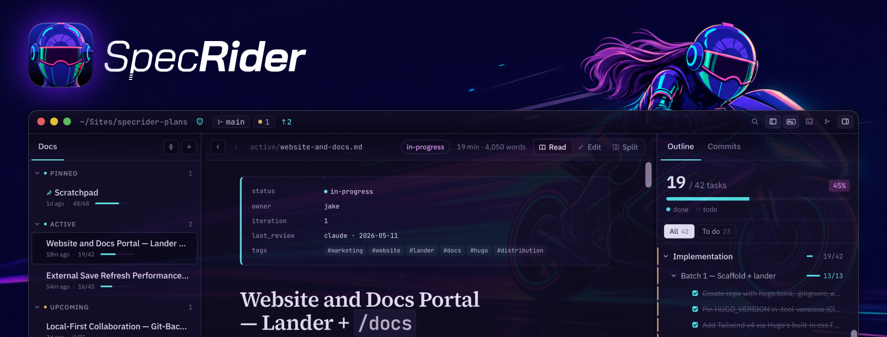

[](https://specrider.ai)

# SpecRider

*A workspace for spec-driven development.*

SpecRider is a workspace for spec-driven development: Git-backed Markdown specs as the source of truth for humans and agents.

How you use Markdown files for managing your work is up to you, your team, and your agents. Here's our system in a nutshell:

* A Markdown spec for each new feature with multiple phases and groups of tasks
* A simple folder structure for organizing active, upcoming, backlog, and archived specs
* An index of prioritized specs to track what to build next
* Agents and humans collaborate on these specs together

That's it. We designed a purpose-built workflow tool specifically for Markdown specs:

1. Quickly navigate, review, edit complex Markdown files with detailed outlines
2. Understand and review code changes tied to a Markdown spec
3. Iterate on specs (and optionally code) with any agent we want in the terminal

We hope you enjoy it.

## Features

- **Outline as the primary surface** — persistent right rail, syncs with scroll position. H1/H2/H3 headings, optional numbered and bulleted list items, task progress per section, click-to-jump with highlight-fade. Three outline-row toggles in Settings → Editor & Outline let you choose what shows.
- **Reading-optimized document pane** — Source Serif 4 body, IBM Plex Sans UI, configurable size/line-height/density, hyphenation, body & code ligatures, and a Markdown engine tuned for long documents (collapsible sections, full-width tables, syntax-highlighted code via Shiki).
- **Document browser** — left rail grouped by directory bucket with frontmatter-aware metadata: status, owner, tags, task progress, last-modified time. Inline rename, duplicate, move-between-buckets, and delete via context menu.
- **Spec change awareness** — when the plans folder is in a Git repo, gutter bars / outline-row stripes / inline diff popovers show what's changed against HEAD. Optional per-line blame in the Markdown editor.
- **Markdown editor handoff** — `⌘E` flips Read mode to a CodeMirror-backed editor on the same file with line numbers, soft-wrap, and search.
- **Multi-window management** — one plans-root per window, persisted independently. Open a specific plan in a new window from the context menu.
- **Quick switcher & project search** — `⌘P` to jump between plans, `⌘⇧F` to search across the folder.
- **Beautiful themes** — bundled light & dark themes, accent color override, drop a JSON file into `themes/` to add your own (see `docs/guides/theming.md`).

## Releases

Signed desktop builds are published to [GitHub Releases](https://github.com/specrider/specrider/releases) for macOS (Apple silicon) and Linux (x86_64 AppImage). Installed apps auto-update from the same channel.

## Stack

- **Frontend** — React 19 + TypeScript + Vite, Markdown via `unified` / `remark` / `mdast`, code highlighting via `shiki`, editor via CodeMirror 6.
- **Backend** — Rust via Tauri 2. File watching via `notify`, walks via `walkdir`, frontmatter via `serde_yaml`. Git operations shell out to the `git` binary.

## Development

Requires [Rust](https://rustup.rs), [Node.js](https://nodejs.org), and [pnpm](https://pnpm.io).

```bash
pnpm install
pnpm tauri dev   # run the desktop app with hot reload
```

Other scripts:

```bash
pnpm dev         # frontend-only Vite dev server (no Tauri shell)
pnpm build       # tsc + vite build (frontend)
pnpm test        # frontend/unit test suite
pnpm test:coverage
pnpm tauri build # produce a desktop bundle
```

The Rust crate lives in `src-tauri/`. Run `cargo check` from there for a backend-only typecheck, or `cargo test --manifest-path src-tauri/Cargo.toml` from the repo root for backend tests. See `docs/guides/testing.md` for coverage slices and test patterns.

## Project layout

```
src/                    React frontend
  App.tsx               top-level layout, navigation, mode switching
  components/           Reader, OutlinePane, MarkdownEditor, DocumentBrowser, etc.
  markdown/             parse + render + outline extraction
  settings/             persisted AppSettings, theme catalog, font picker
  search/               quick-switch palette, find-in-project
  hooks/                useDiff / useBlame / useCollapsedSections / etc.
src-tauri/src/          Rust backend (Tauri commands, file ops, watcher, git)
```

## Custom Themes

Bundled themes live in `src/settings/themes/`. To add your own, drop a JSON file into the app's config directory under `themes/` — on macOS that's `~/Library/Application Support/dev.specrider.app/themes/`. Themes appear in Settings → Appearance within a second. See `docs/guides/theming.md` for the variable reference.

## Contributing

PRs welcome. Every commit needs a DCO `Signed-off-by:` line — `git commit -s` adds it automatically. See [`CONTRIBUTING.md`](CONTRIBUTING.md) for the full flow.

## License

SpecRider is licensed under the **GNU General Public License v3.0 or later** ([`LICENSE`](LICENSE)).

In plain English: you can use SpecRider freely, modify it however you like, and share those modifications. If you distribute a modified version, your modifications must also be released under GPL-3.0. Internal-only modifications you don't distribute carry no publication obligation.

## Trademarks

"SpecRider" and the SpecRider logo are trademarks of 805 Software LLC. The GPLv3 grant covers source code only — it does not grant trademark rights. Forks and derivative works must rename and rebrand. See [`TRADEMARKS.md`](TRADEMARKS.md) for the full policy.

---

Copyright © 2026 805 Software LLC.
SpecRider is released under GPL-3.0-or-later.
